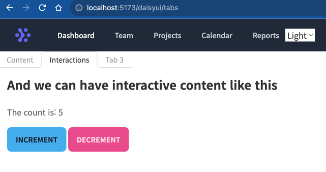

# bun-daisyui-app

원하는 UI 구성을 위해 유틸리티 CSS 라이브러리인 TailwindCSS 와 daisyUI 를 공부합니다. 웹프레임워크로 SveltKit 을 사용하고 bun 런타임 위에서 실행합니다.

## 0. 개요

- [x] Bun 1.0.10 + SvelteKit 1.20.4
- [x] TailwindCSS 3.3.5
  - daisyUI 3.9.4
  - theme-change
- [x] Etc
  - heroicons
  - purgecss

> svelte 와 daisyui 로 구현한 tabs 컴포넌트



## 1. 프로젝트 생성

### [SvelteKit](https://kit.svelte.dev/) 프로젝트 생성

```bash
bun create svelte@latest bun-daisyui-app
  # - Skeleton project
  # - Typescript

cd bun-daisyui-app
bun install

bun run dev
```

### [TailwindCSS 및 daisyUI 설정](https://daisyui.com/docs/install/)

1. TailwindCSS, tailwind-merge 설치
2. 한글 폰트, daisyUI 라이브러리 설치
3. `tailwind.config.js` 에 daisyUI 설정 추가
4. `app.postcss` 에 Tailwind directives 추가
5. 최상위 `+layout.svelte` 에 전역 css 추가
6. `+page.svelte` 에 데모 코드를 넣어 daisyUI 작동 확인

```bash
bun add -d tailwindcss autoprefixer tailwind-merge
bun add -d @tailwindcss/typography daisyui@latest
bunx tailwindcss init -p

# D2Coding 폰트 추가 (Mac 에서는 첫번째 "" 인자가 필요하다)
sed -i '' 's/favicon.png" \/>/favicon.png" \/>\n    <link href="http:\/\/cdn.jsdelivr.net\/gh\/joungkyun\/font-d2coding\/d2coding.css" rel="stylesheet" type="text\/css">/' src/app.html

# lang, daisyUI theme 설정
sed -i '' 's/html lang="en"/html lang="ko" data-theme="dark"/' src/app.html

# default font, daisyUI 설정
cat <<EOF > tailwind.config.js
const defaultTheme = require('tailwindcss/defaultTheme');

/** @type {import('tailwindcss').Config} */
export default {
  content: ['./src/**/*.{html,js,svelte,ts}'],
  theme: {
    extend: {
      fontFamily: {
        sans: ['"Noto Sans KR"', ...defaultTheme.fontFamily.sans],
        serif: ['"Noto Serif KR"', ...defaultTheme.fontFamily.serif],
        mono: ['D2Coding', ...defaultTheme.fontFamily.mono],
      },
    },
  },
  plugins: [require('@tailwindcss/typography'), require('daisyui')],
  daisyui: {
    logs: false,
    themes: ['cmyk', 'dark', 'lofi'], // HTML[data-theme]
  },
};
EOF

cat <<EOF > src/app.postcss
/* fonts: Noto Color Emoji, Noto Sans KR, Noto Serif KR */
@import url('https://fonts.googleapis.com/css2?family=Noto+Color+Emoji&family=Noto+Sans+KR:wght@300;400;500;700&family=Noto+Serif+KR:wght@400;700&display=swap');

@tailwind base;
@tailwind components;
@tailwind utilities;
EOF

cat <<EOF > src/routes/+layout.svelte
<script lang="ts">
  import '../app.postcss';
</script>

<slot />
EOF

# daisyUI hero 데모
cat <<EOF > src/routes/+page.svelte
<div class="hero min-h-screen bg-base-200">
  <div class="hero-content text-center">
    <div class="max-w-md">
      <h1 class="text-5xl font-bold">안녕, daisyUI</h1>
      <p class="py-6">with TailwindCSS + SvelteKit + Bun</p>
      <button class="btn btn-primary">시작하기</button>
    </div>
  </div>
</div>
EOF

bun run dev
```

#### daisyUI [theme-change 추가](https://github.com/saadeghi/theme-change)

- 설치 : `bun add theme-change`

```html
<script>
  import { onMount } from 'svelte';
  import { themeChange } from 'theme-change';

  onMount(() => {
    themeChange(false);
    // 👆 false parameter is required for svelte
  });
</script>

<select data-choose-theme>
  <option value="cmyk">Light</option>
  <option value="dark">Dark</option>
  <option value="lofi">Other</option>
</select>
```

#### [heroicons](https://heroicons.com/) 와 [purgecss](https://www.skeleton.dev/docs/purgecss) 설치

- svelte 용 heroicons 설치 (MIT 라이센스)
- tailwindcss 최적화를 위한 vite 전용 purgecss 플러그인 설치

```bash
bun add -d svelte-hero-icons
bun add -d vite-plugin-tailwind-purgecss

cat <<EOF > vite.config.ts
import { purgeCss } from 'vite-plugin-tailwind-purgecss';
import { sveltekit } from '@sveltejs/kit/vite';
import { defineConfig } from 'vite';

export default defineConfig({
  plugins: [sveltekit(), purgeCss()],
  ssr: {
    noExternal: ['svelte-hero-icons'],
  },
});
EOF
```

## 2. daisyUI 로 Tab 컴포넌트 만들기

### [daisyUI 의 Tab 스타일](https://daisyui.com/components/tab/#lifted)

이것만으로는 tab 을 클릭할 수도, 전환할 수도, 내용을 출력할 수도 없다.

- `tab-lifted` 스타일
- `tab-active` : 활성화 탭을 강조

```html
<div class="tabs">
  <a class="tab tab-lifted">Tab 1</a>
  <a class="tab tab-lifted tab-active">Tab 2</a>
  <a class="tab tab-lifted">Tab 3</a>
</div>
```

#### [Svelte Tab component 예제](https://svelte.dev/repl/cf05bd4a4ca14fb8ace8b6cdebbb58da?version=4.2.2)

기본 예제에 daisyUI 를 적용했다. (context 사용 예제도 추가)

> `+page.svelte` : 탭 그룹이 출력될 페이지

```html
<!-- +page.svelte -->
<script>
  import Tab1 from './Tab1.svelte';
  import Tab2 from './Tab2.svelte';
  import Tab3 from './Tab3.svelte';
  import Tabs from './Tabs.svelte'; // TapGroup

  // List of tab items with labels, values and assigned components
  let items = [
    { label: 'Content', value: 1, component: Tab1 },
    { label: 'Interactions', value: 2, component: Tab2 },
    { label: 'Tab 3', value: 3, component: Tab3 },
  ];

  import { setContext } from 'svelte';
  setContext('count', 5); // Tab2 의 count 초기값
</script>

<Tabs {items} />
```

> `Tabs.svelte` : 탭 그룹

- tab 라벨 클릭시 activeTabValue 변경하고 `tab-active` 활성화
- tab 라벨과 컴포넌트들을 index 값 순서로 출력
- svelte 컴포넌트
  - TS 타입 선언시 `import('svelte').ComponentType` 사용
  - `svelte:component` 를 이용해 바인딩

```html
<!-- Tabs.svelte -->
<script>
  /**
   * TabItem 타입 정의
   * @typedef {Object} TabItem
   * @property {string} label - 탭 이름
   * @property {number} value - 탭 번호
   * @property {import('svelte').ComponentType} component - 탭 내용
   */

  /** @type { TabItem[] } */
  export let items = [];
  export let activeTabValue = 1;

  const handleClick = (/** @type {number} */ tabValue) => () =>
    (activeTabValue = tabValue);
</script>

<div class="container">
  <div class="tabs">
    {#each items as item (item.value)}
      <a class="tab tab-lifted"
        class:tab-active={activeTabValue === item.value}
        on:click={handleClick(item.value)}
        >{item.label}</a>
    {/each}
  </div>
  {#each items as item (item.value)}
    {#if activeTabValue == item.value}
      <div class="border p-4">
        <svelte:component this={item.component} />
      </div>
    {/if}
  {/each}
</div>
```

> `Tab2.svelte` : 탭 아이템

- daisyUI 에서 typography 사용시 prose 클래스로 감싸야 함
- context 로부터 count 초기값을 받고, 종료시 context 에 저장

```html
<!-- Tab2.svelte -->
<script lang="ts">
  import { setContext, getContext, onDestroy } from 'svelte';
  let count = getContext<number>('count') ?? 1;
  onDestroy(() => {
    setContext('count', count); // 탭 전환 전에 count 저장
  });
</script>

<article class="prose">
  <h2 class="h2">And we can have interactive content like this</h2>
  <p>
    The count is: {count}
  </p>
</article>
<div class="pt-4">
  <button class="btn btn-primary" on:click={() => (count += 1)}>
    Increment
  </button>
  <button class="btn btn-secondary" on:click={() => (count -= 1)}>
    Decrement
  </button>
</div>
```

## 9. 참고사항

- Tabs 를 기준으로 flowbite 와 skeleton 의 소스를 살펴보았다.
  - flowbite 는 프로그래밍 요소가 많다.
  - skeleton 은 aria 및 a11y 규격을 신경썼다.
- daisyUI 가 스타일이 제일 깔끔하고 이쁘다. 내 입맛대로 쓸 수 있으면 좋겠다.
  - 가볍고, 단순하게 필요한 만큼만 기능을 정의해서 쓰면 최고
  - 조만간 4.0 이 나온다고 한다. 클래스가 더 깔끔해졌다.

### [svelte 에서 a11y warning 비활성화 시키기](https://github.com/sveltejs/language-tools/issues/650#issuecomment-1729917996)

a11y 의 좋은 목적은 알겠지만, 신경 쓰이는 경우가 많아 disable 시키고 싶었다.

> vscode 의 settings.json 에서 설정

```json
"svelte.plugin.svelte.compilerWarnings": {
    "a11y-aria-attributes": "ignore",
    "a11y-incorrect-aria-attribute-type": "ignore",
    "a11y-unknown-aria-attribute": "ignore",
    "a11y-hidden": "ignore",
    "a11y-misplaced-role": "ignore",
    "a11y-unknown-role": "ignore",
    "a11y-no-abstract-role": "ignore",
    "a11y-no-redundant-roles": "ignore",
    "a11y-role-has-required-aria-props": "ignore",
    "a11y-accesskey": "ignore",
    "a11y-autofocus": "ignore",
    "a11y-misplaced-scope": "ignore",
    "a11y-positive-tabindex": "ignore",
    "a11y-invalid-attribute": "ignore",
    "a11y-missing-attribute": "ignore",
    "a11y-img-redundant-alt": "ignore",
    "a11y-label-has-associated-control": "ignore",
    "a11y-media-has-caption": "ignore",
    "a11y-distracting-elements": "ignore",
    "a11y-structure": "ignore",
    "a11y-mouse-events-have-key-events": "ignore",
    "a11y-missing-content": "ignore",
    "a11y-no-static-element-interactions":"ignore"
}
```

> `sveltekit.config.js` 에서 컴파일 옵션 설정

```js
const config = {
  preprocess: vitePreprocess(),
  onwarn: (warning, handler) => {
    if (warning.code.startsWith('a11y-')) {
      return;
    }
    handler(warning);
  },
  // ...
};
```

&nbsp; <br />
&nbsp; <br />

> **끝!** &nbsp;
